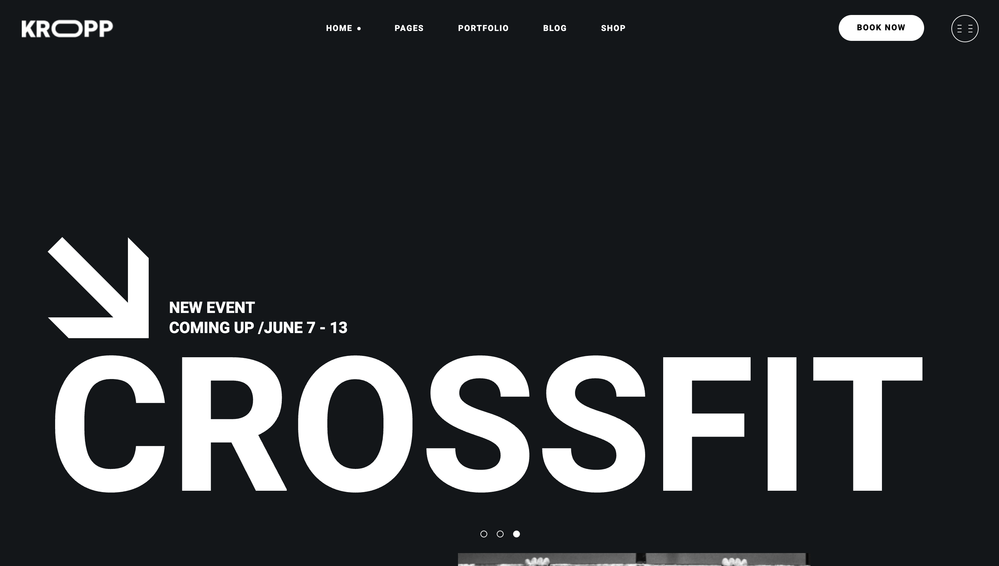

# Kropp Fitness

### Project Overview
Kropp is a modern, high-performance landing page for a fitness club. The project was built to demonstrate a professional approach to creating clean, maintainable, and responsive static websites. The primary goal was to implement a complex design layout using modern CSS techniques while maintaining a highly organized project structure suitable for scaling.

### Tech Stack
- **HTML5**: Semantic markup for accessibility and SEO.
- **CSS3**: Advanced layouts using Flexbox and CSS Grid.
- **CSS Custom Properties**: A centralized variable system for colors, typography, and spacing to ensure design consistency and ease of theme management.
- **Modular CSS Architecture**: Using `@import` rules and a structured directory (`base`, `components`, `layout`) to keep styles organized and maintainable.
- **SVG Graphics**: Vector icons for high-quality rendering across all display resolutions.

### Features
- **Responsive Hero Banner**: Engaging entry point with dynamic event highlights.
- **Training Types Catalog**: Visual grid showcasing various workout programs (Maxpump, Fit & Tone, etc.).
- **Join Us Conversion Section**: Integrated subscription form and video showcase.
- **BMI Calculator UI**: Interactive-ready table and form for body mass index estimation.
- **Location Finder**: Visual map integration for branch discovery.
- **Fit Family Gallery**: Dynamic image grid showcasing the community.
- **Professional Footer**: Complete with working hours, contact information, and social media integration.

### Project Structure
The project follows a modular directory structure to separate concerns and improve developer experience:
- `assets/`: Contains all static resources.
    - `fonts/`: Local web-font files (Heebo, Yantramanav).
    - `icons/`: SVG icons and arrows.
    - `images/`: Optimized content images (JPG/PNG/SVG).
- `styles/`: Modular CSS files.
    - `base/`: Resets, variables, and global styles.
    - `components/`: Reusable UI elements (buttons, inputs).
    - `layout/`: Section-specific styles (header, footer, sections).
- `index.html`: Entry point with semantic structure.
- `preview.png`: Visual representation of the landing page.

### Getting Started

#### Prerequisites
- A modern web browser (Chrome, Firefox, Safari, Edge).
- A local development server (recommended for optimal performance).

#### Installation
1. Clone the repository:
   ```bash
   git clone https://github.com/your-username/kropp-fitness.git
   ```
2. Navigate to the project directory:
   ```bash
   cd kropp-fitness
   ```

#### Running Locally
Since this is a static project, you can simply open `index.html` in your browser. However, for the best experience with CSS imports and relative paths, it is recommended to use a local server:

Using **VS Code Live Server**:
1. Open the project in VS Code.
2. Click "Go Live" in the status bar.

Using **Node.js (serve)**:
```bash
npx serve .
```

### Development Notes
- **Naming Convention**: A consistent naming convention (similar to BEM) is used to prevent style leakage and ensure clear relationships between parent and child elements.
- **CSS Variables**: All key design tokens (colors, fonts, borders) are defined in `styles/base/variables.css`, making it trivial to update the brand identity project-wide.
- **Layout Strategy**: Flexbox is prioritized for component alignment, while CSS Grid is utilized for complex section layouts like the Training Types and Family Gallery.
- **Performance**: Fonts are loaded locally via `@font-face` to minimize external requests and prevent layout shifts.

### Possible Improvements
- **Interactive Logic**: Implement the BMI calculator functionality using JavaScript.
- **Form Validation**: Add client-side validation for the "Join Us" and subscription forms.
- **Image Optimization**: Implement responsive images using `srcset` for better mobile performance.
- **Build Step**: Introduce a build tool (like Vite or PostCSS) to bundle CSS and minify assets for production.

### Screenshots or Demo


### Author Notes
This project was developed as part of a journey to master professional CSS architecture and semantic HTML. The focus was on writing "clean code" that another developer could easily read and extend. Moving forward, I plan to integrate a small JavaScript framework to handle interactive components and form submissions.
